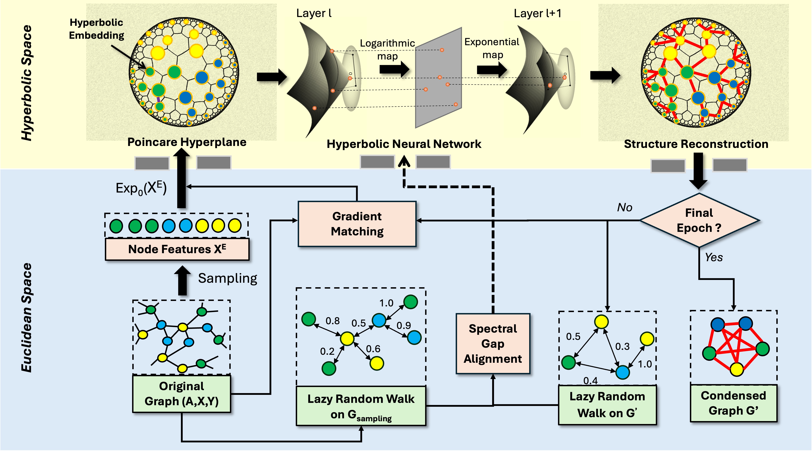

# HyDRO: Random Walk Guided Hyperbolic Graph Distillation

<p align="center">
  
</p>

<p align="center">
  <a href="https://arxiv.org/abs/2501.15696"></a>
  <a href="https://arxiv.org/html/2503.12156v1"></a>
  <a href="https://www.python.org/downloads/"></a>
  <a href="https://pytorch.org/"></a>
  <a href="https://opensource.org/licenses/MIT"></a>
</p>

## Overview

**HyDRO** (Hyperbolic Graph Distillation with Random Walks Optimization) is a novel graph distillation framework that leverages hyperbolic embeddings to capture complex hierarchical patterns and optimizes the spectral gap to preserve random walk properties in condensed graphs.

**Key contributions:**
- First graph distillation method to operate in **hyperbolic space**, capturing tree-like structures with minimal distortion
- **Spectral gap alignment** preserves dynamic random walk properties, enabling state-of-the-art continual graph learning
- **State-of-the-art link prediction** from distilled graphs, demonstrating superior task generalization
- Strong balance between utility, privacy preservation, and noise robustness

This repository also includes **HyDRO+**, an extension for efficient privacy-preserving link prediction via condensed graphs.

Built upon the [GraphSlim](https://github.com/Emory-Melody/GraphSlim/tree/main) framework.

---

## Installation

### Requirements

| Component | Version |
|-----------|---------|
| Python    | >= 3.8  |
| PyTorch   | >= 2.0 (recommended 2.2.2) |
| CUDA      | >= 12.1 (recommended 12.4) |
| OS        | Linux (recommended), Windows, macOS |

### Setup

```bash
git clone https://github.com/Yunbo-max/HyDRO.git
cd HyDRO

# Install package in development mode
pip install -e .

# Install dependencies
pip install -r requirements.txt

# Install PyG extensions (adjust versions to match your PyTorch/CUDA)
pip install torch_scatter torch_sparse -f https://data.pyg.org/whl/torch-2.2.2+cu121.html
```

<details>
<summary><b>PyTorch 1.x setup</b></summary>

```bash
pip install -r graphslim/requirements_torch1+.txt
pip install torch_scatter torch_sparse -f https://data.pyg.org/whl/torch-1.12.1+cu116.html
```
</details>

### Datasets

Datasets are downloaded automatically on first run:
- **Transductive**: Cora, Citeseer, PubMed, DBLP, ogbn-arxiv (via PyG / GraphSAINT)
- **Inductive**: Flickr, Reddit (via PyG)

---

## Quick Start

```bash
# Run HyDRO on Cora (50% reduction rate)
cd run
python train_all.py -M hydro -D cora -R 0.5

# Or from repo root
bash run.sh cora 0.5
```

### Command-Line Arguments

| Argument | Flag | Description | Default |
|----------|------|-------------|---------|
| Method   | `-M` | Distillation method | `hydro` |
| Dataset  | `-D` | Dataset name | `cora` |
| Reduction rate | `-R` | Target reduction ratio | `0.5` |
| GPU      | `-G` | GPU ID (-1 for CPU) | `0` |
| Setting  | `--setting` | `trans` or `ind` | auto |
| Init     | `--init` | Feature initialization | `random` |

---

## Reproducing Paper Results

All experiment scripts are in `run/scripts/`. Execute from that directory:

```bash
cd run/scripts
```

### Node Classification (Table 1)
```bash
bash performance_HyDRO.sh
```

### Link Prediction & Task Generalization (Table 2)
```bash
bash mia_links.sh
```

### Neural Architecture Search (Table 3)
```bash
bash nas.sh
```

### Robustness to Noise (Table 4)
```bash
bash robustness.sh
```

### HyDRO+ with Coarsening Initialization
```bash
bash performance_HyDRO+.sh
```

### Additional Experiments

| Script | Task |
|--------|------|
| `mia_nodes.sh` | Membership inference attack |
| `graph_property.sh` | Graph property preservation |
| `visual.sh` | Visualization of condensed graphs |

### Continual Graph Learning

CGL evaluation follows the [CaT framework](https://github.com/superallen13/GCondenser). See the paper appendix for configuration details.

---

## Method

HyDRO consists of three main components:

1. **Hyperbolic Structure Learning**: Node features are embedded into the Poincare ball via exponential map, processed through Mobius linear layers, and decoded into a symmetric adjacency matrix.

2. **Gradient Matching**: Aligns GNN parameter gradients between the original and synthetic graphs per class.

3. **Spectral Gap Optimization**: Minimizes the difference in spectral gaps (second-largest eigenvalue of lazy random walk matrices) to preserve global diffusion properties.

The total loss is:

```
L_total = L_gradient + L_spectral + beta * L_regularization
```

---

## Hyperparameters

Per-dataset configs are in `graphslim/configs/hydro/<dataset>.json`:

| Parameter | Default | Description |
|-----------|---------|-------------|
| `lr_feat` | 1e-4 | Feature learning rate (Adam) |
| `lr_adj` | 1e-4 | Structure learning rate (Riemannian SGD) |
| `curvature` | 0.01 | Poincare ball curvature |
| `momentum` | 0.01 | Riemannian SGD momentum |
| `beta` | 0.1 | Regularization weight |
| `epochs` | 600 | Training epochs |
| `outer_loop` | 20 | Outer optimization iterations |
| `inner_loop` | 15 | Inner model update steps |
| `condense_model` | SGC | Model for condensation |

---

## Project Structure

```
HyDRO/
├── graphslim/                 # Core library
│   ├── condensation/          # Distillation methods
│   │   ├── hydro.py           # HyDRO implementation
│   │   ├── gcond_base.py      # Base class for condensation
│   │   └── ...                # Other baselines (GCond, SGDD, GDEM, etc.)
│   ├── models/                # Neural network architectures
│   │   ├── HNN_transition.py  # Hyperbolic neural network (MobiusLinear)
│   │   └── ...                # GCN, GAT, SGC, GraphSage, etc.
│   ├── dataset/               # Data loading and preprocessing
│   ├── evaluation/            # Evaluation pipelines
│   ├── configs/               # JSON hyperparameter configs
│   ├── coarsening/            # Graph coarsening methods
│   └── sparsification/        # Graph sparsification methods
├── run/                       # Experiment scripts
│   ├── train_all.py           # Main training entry point
│   ├── run_eval.py            # Evaluation entry point
│   ├── run_eval_Link.py       # Link prediction evaluation
│   ├── run_nas.py             # NAS evaluation
│   └── scripts/               # Bash scripts for batch experiments
├── requirements.txt           # Dependencies
├── setup.py                   # Package setup
└── run.sh                     # Quick-start script
```

---

## Citation

If you find this work useful, please cite:

```bibtex
@article{long2025random,
  title={Random Walk Guided Hyperbolic Graph Distillation},
  author={Long, Yunbo and Zhang, Jiaquan and Xu, Liming and Schoepf, Stefan and Brintrup, Alexandra},
  journal={arXiv preprint arXiv:2501.15696},
  year={2025}
}

@article{long2025efficient,
  title={Efficient and Privacy-Preserved Link Prediction via Condensed Graphs},
  author={Long, Yunbo and Xu, Liming and Brintrup, Alexandra},
  journal={arXiv preprint arXiv:2503.12156},
  year={2025}
}
```

## Acknowledgements

This codebase builds on [GraphSlim](https://github.com/Emory-Melody/GraphSlim) and uses [geoopt](https://github.com/geoopt/geoopt) for Riemannian optimization.
